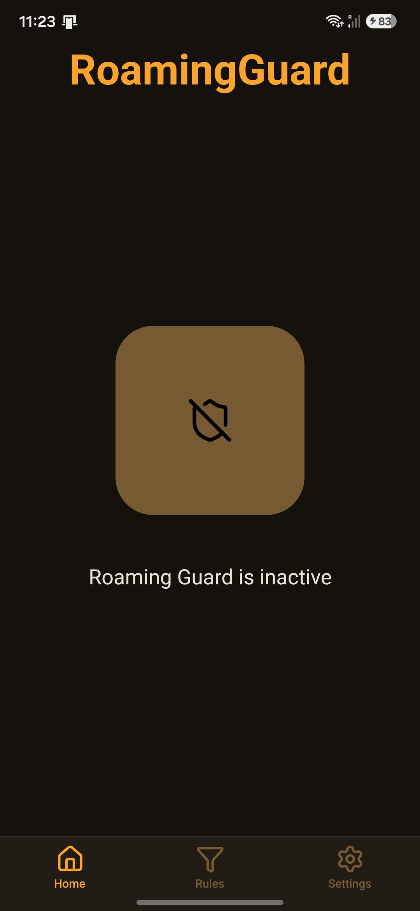
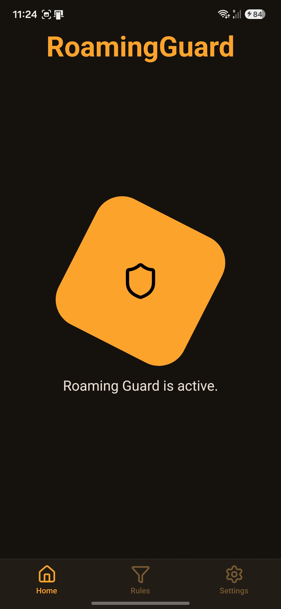
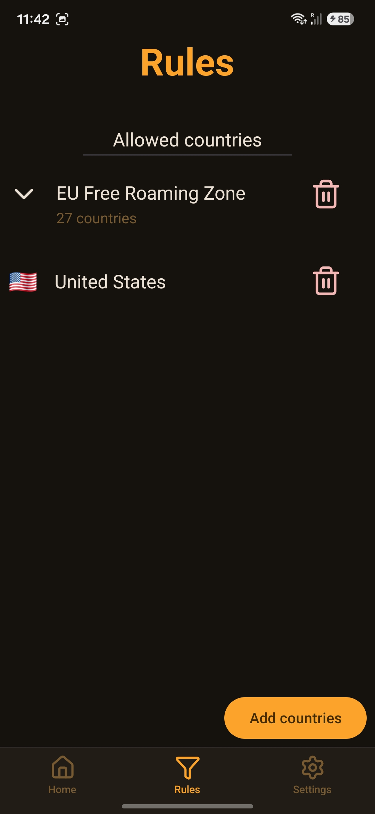
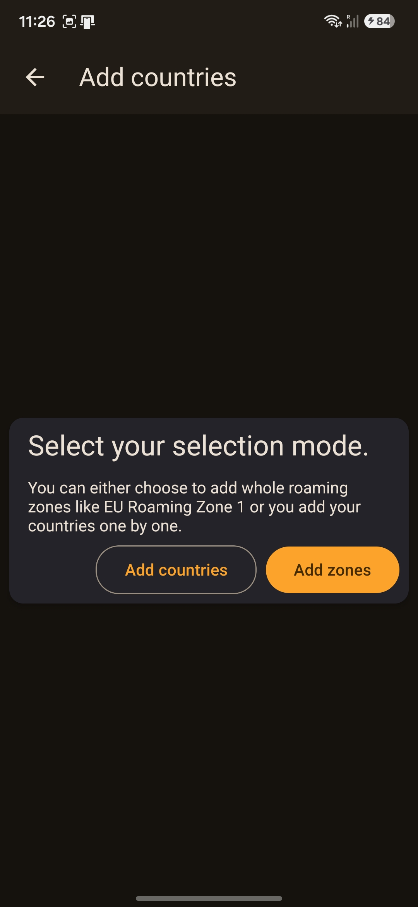
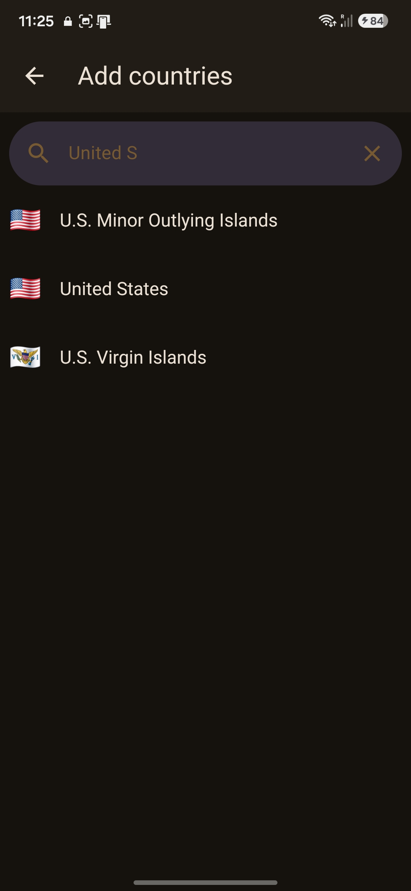
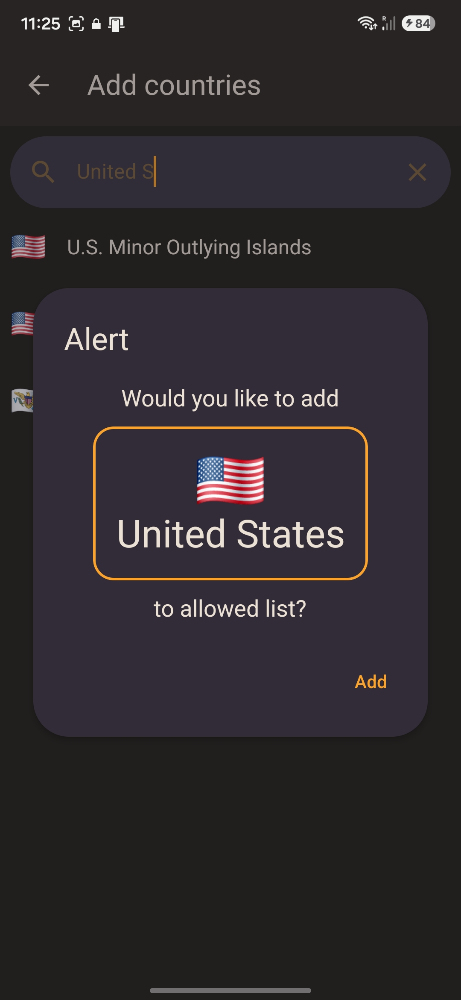
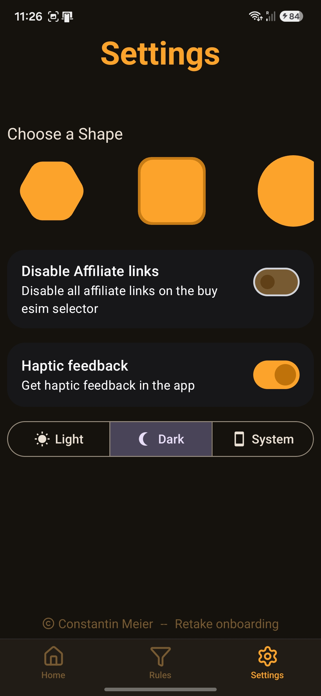
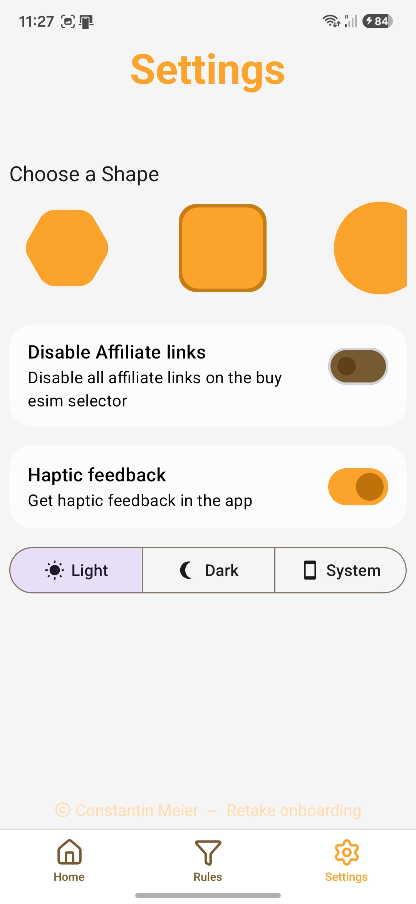
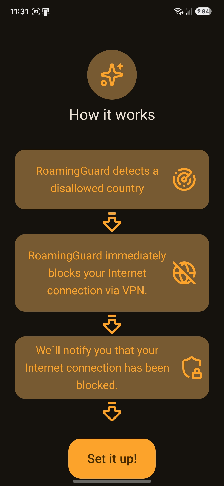

# RoamingGuard
An app that blocks your internet traffic if you are in a disallowed contry so you don´t acceddently pay for roaming fees.

## Features
- Fully functional Internet Blocking
- Custom Rules
- Onboarding
- Customization
- Light/Dark Mode
- Enable/Disable haptic feedback and affiliate links

## How it works
It uses a fully functional native module, that starts a vpn connection when a disallowed country is detected, which blocks your internet connection.
The vpn is fully local. In the rules tab you can add new countries or zones to the allowed list. Everything else will be blocked.
In settings you can customize the app, set a theme and disable or enable haptic or affiliate links. 

## How to build it yourself

1. Clone the repo with

   ```bash
   git clone https://github.com/CoolV3/RoamingBlocker
   ```

2. Install dependencies

   ```bash
   pnpm install
   ```

3. Start the app

   ```bash
   pnpm expo run:android
   ```
**Note:** The app does not run in expo go!


## Tech Stack
- React Native with Expo Framework
- Uniwind for styling
- React native paper for Material UI Components
- Expo UI for some components that require native styling.
- Lucide React Native for the icons

## Why I built it
Because we went on a trip to monaco, and we forgot to turn mobile data off, and I wanted this to never happen again.

## Screenshots of the app
<p align="center">
   
   
   
</p>

<p align="center">
   
   
   
</p>

<p align="center">
   
   
   
</p>


